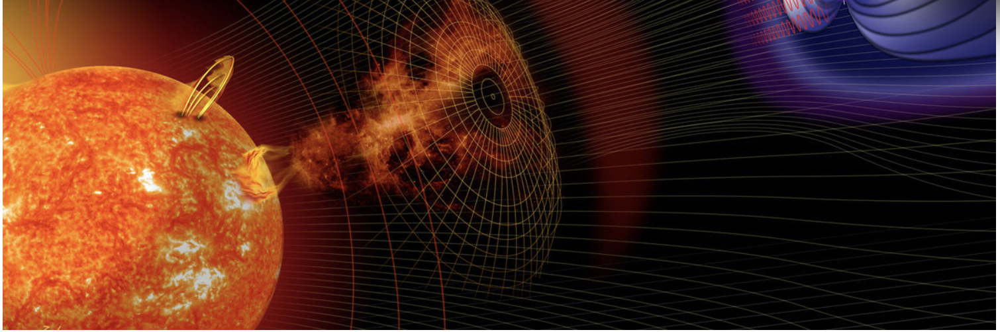
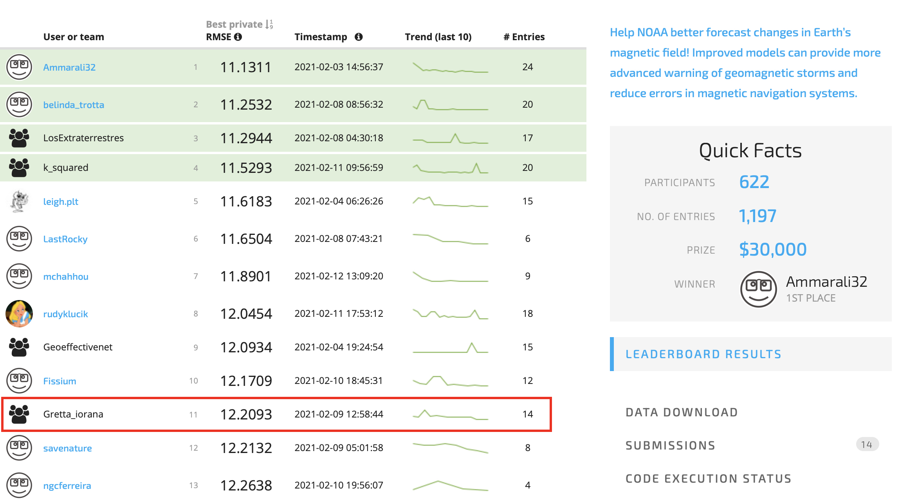
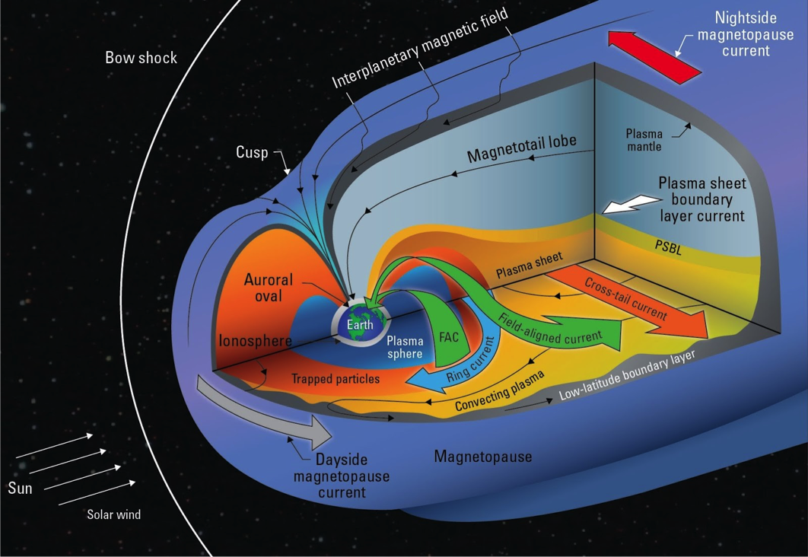
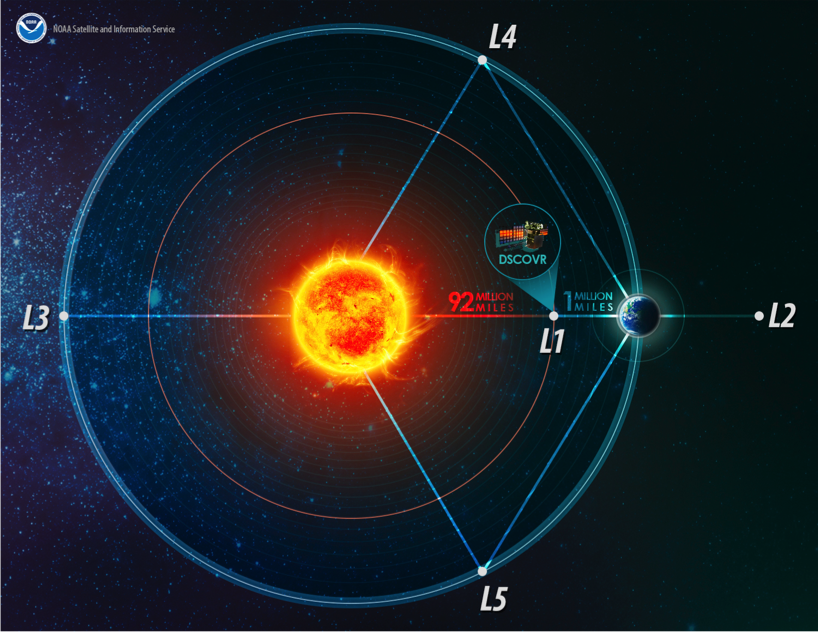
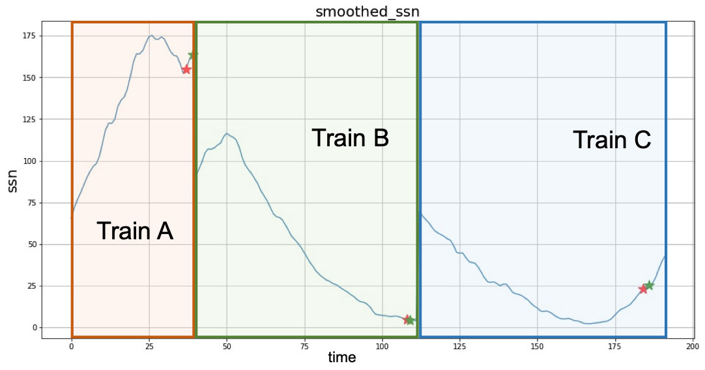
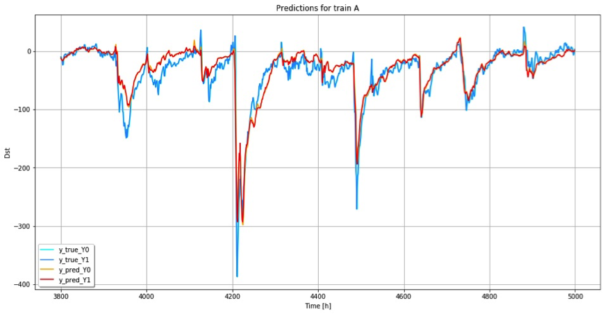
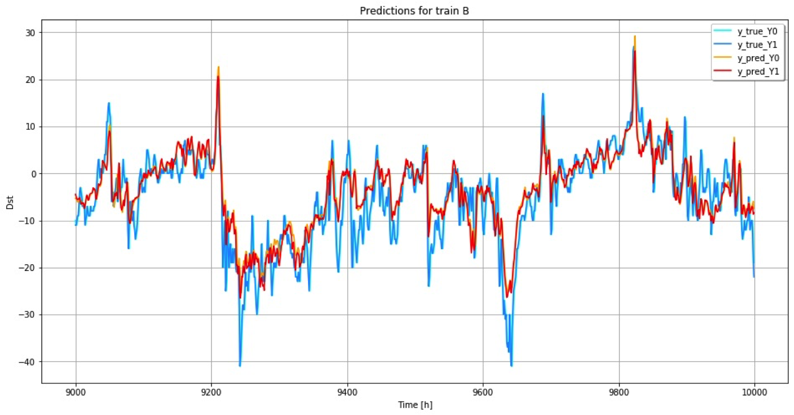
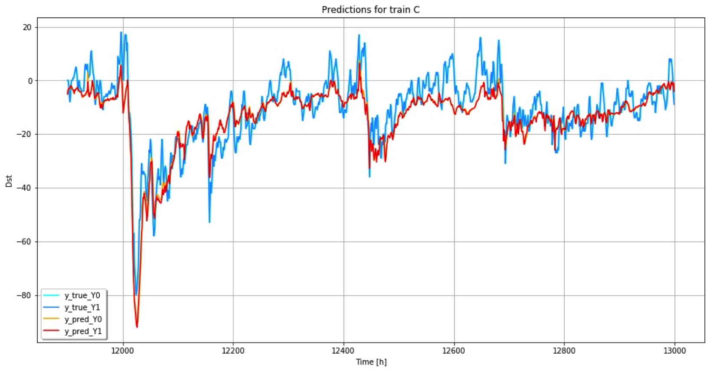

# MagNet-Model-the-Geomagnetic-Field

*Image credits: NOAA, NASA, datadriven*

[Link to the competition home page](https://www.drivendata.org/competitions/73/noaa-magnetic-forecasting/page/279/)

The competition finished on February 12, and in the private leaderboard our team (Anna Kotova and Oleg Polivin) was on 11th place (out of 622 participants).

We guess that many participants used a very similar architecture for trianing neural networks, but the "secret" ingredient that took us to the 11th place was [feature engineering](https://github.com/olegpolivin/MagNet-Model-the-Geomagnetic-Field/blob/main/train/prepare_data.py). Out of several key variables to predict the `DST` index, we constructed `87` various aggregate measures describing the solar wind/sun activity.

## Overview of the MagNet competition

Transfer of energy from solar wind into the Earth’s magnetic field causes geomagnetic storms. The resulting variations in the magnetic field increase errors in magnetic navigation. The disturbance-storm-time index, or Dst, is a measure of the severity of the geomagnetic storm.

It is important to accurately predict the geomagnetic storms. The main reason is to protect electronic equipment that could be damaged during such events. For example,

- it might help to protect satellites on low orbits against radiaiton hazard. If you do not move a satellite from a low orbit to a higher one before geomagnetic storm begins electronic equipment on the satellite could be destroyed.
- geomagnetic storms are harmful to electrical transmission equipment, especially transformers—inducing core saturation, constraining their performance (as well as tripping various safety devices), and causing coils and cores to heat up. In extreme cases, this heat can disable or destroy them, even inducing a chain reaction that can overload transformers.
- geomagnetic storms could cause electrical blackouts on a massive scale.

Thus, the main objective of the competition was to predict the `DST` index as accurately as possible.

**Earth's magnetosphere.**

*The Dst or disturbance-storm-time index is a measure of the “ring current” (blue) around the Earth. The ring current is an electric current carried by charged particles trapped in the magnetosphere. Image credits: NOAA, NASA, drivendata.*

## The Disturbance Storm Index: Problem Description

Dst values are measured by 4 ground-based observatories near the equator. These values are then averaged to provide a measurement of Dst for any given hour. However, these values are not always provided in a timely manner. Task is to build a model that can predict Dst in real-time for both the current hour and the next hour. For example, if the current timestep is 10:00am, we must predict Dst for both 10:00am and 11:00am using data up until but not including 10:00am. This is a real-time prediction task. Therefore, your solution may not use data captured at the same or later in time to predict Dst, and it may not take Dst as an input.

**Forecast Dst solely from solar-wind observations at the Lagrangian (L1) position using satellite data from NOAA’s Deep Space Climate Observatory (DSCOVR) and NASA's Advanced Composition Explorer (ACE).**

*Image credits: NOAA, NASA, drivendata*

## Brief description of the data
- `sunspots.csv` - Smoothed sunspot counts - monthly
- `satellite_positions.csv` - Coordinate positions for ACE and DSCOVR – daily
- `dst_labels.csv` - Dst values averaged across the four stations - hourly
- `solar_wind.csv` - Solar wind data collected from ACE and DSCOVR Satellites – minutely

Sun activity is one of the most important predictors of geomagnetic stroms, so here is the graph showing sun activity measured by the number of sunspots in the three train periods provided in the data:

**Sun activity measured by the number of sunspots**

## Performance evaluation

- One week of historical solar wind data per prediction was provided in the code execution environment
- Performance was evaluated according to Root Mean Squared Error (RMSE). - RMSE is calculated on t0 and t+1 simultaneously:
$$\sqrt{\frac{1}{N}\sum_{i=0}^N(y_i - \hat{y}_i)^2}$$
- Submission must complete execution in 8 hours or less, and no single prediction can take more than 20 seconds.

## High-level description of the architecture for final solution

Our input data is a matrix that is `Batch_Size x 72 x 87` dimensions:

- `72` represents `72` hours prior to the observation of the `DST` value
- `87` represents the number of various features that we calculated. 
- We treat the sequential input data with an LSTM model with one hidden layer of size `512`. 
- As an output we get a matrix of `Batch_Size x 72 x 512`. That is, we keep the output features from the only layer of the LSTM for each time t. 
- We reduce the dimensionality of the matrix using Maxpool layer with `kernel_size=3` coupled with `dropout` and a `ReLU` activation. This allows to reduce the dimensinality to `Batch_Size x 72 x 170`.
- The output is flattened, and we apply two fully connected layers separated by `dropout` and `ReLU` activation function.
- First fully-connected layers decreases the dimensionality from `72 x 170 -> 1024` and the second one is `1024 -> 2`. 

Schematically, it could be represented on the following figure:

**Final submit model architecture**

For the exact model see the [model.py](https://github.com/olegpolivin/MagNet-Model-the-Geomagnetic-Field/blob/main/train/model.py) script.

## Prediction results on the validation set
Below we would like to show the prediction results for each of the train periods (A, B, C). We didn't have a separate test set, so the results are shown for the validation sets, that is model was not trained on that data, but was chosen using that data.

**Predictions on train_a period**

**Predictions on train_b period**

**Predictions on train_c period**

